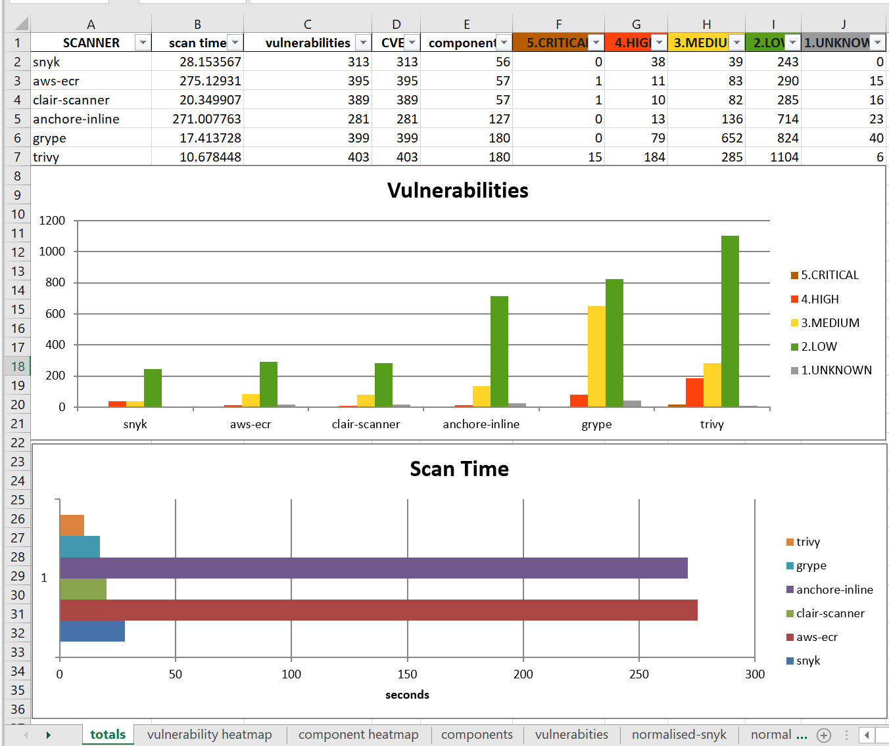

# dmscan - docker-multi-scan 
A multi-scanner utility for docker images. drives Clair, Anchore, Trivy, Snyk, Grype, AWS ECR push on scan. The scanners produce varying results, sometimes hit and miss and dmscan helps you review the results easily and decide how to address them.

*dmscan* run the scans for all register scanners and  then consolidates the results and generates an excel spreadsheet report to help you better understand the results. The spreadsheet contains:

- **Summary tables and charts** by scanner and severity with scanning times, and unique vulnerabilities and cve s (see below for what the difference is) 

- A **Vulnerability and Component Heatmap** which allows you to see at a glance what has been found and what has been ignored. Vulnerabilities have clickable urls to the security advisarables and you can hover on the url to see the description and packages affected. 

- **Vulnerability and Component totals** for each scanner

- **"Normalised results"** with the same column headers, severities mapped to use the same rates. The mapping is configurable and the default mapping 1) groups Informational, and Negligible with Low and 3) Adds a number to make sorting easier. Normalised results have autofilter on by default and conditional formatting to colour code severities.   
  
- **Original results**, generated by the scanners

# Setup #

## prerequisites ##
_dmscan_ requires 
1. Linux/MacOS shell  
2. Docker CLI
3. Python 3.7 or later
4. AWS CLI v2, only if you are going to include AWS ECR scans. In that case you will need to setup your AWS CL2 with a valid Access & Secret key for an account with ECR push and repo creation rights  
5. A snyk account and token, if you are going to include snyk in the scans

##### It has been used/tested on #### 
- Ubuntu
- MacOS
- EC2 Linux on AWS
- WSL2 on Windows 10 pro

## Installing the scanners
You can manually install 
Or use the ./install-scanners.sh to install them in one go:
- chmod +x install-scanners.sh to  make install-scanners.sh executable
- ./install-scanners.sh from the command line to install the scanners

Once they are installed 

## Installing dmscan

## Using dmscan

### running a multiscan
### viewing the results
### customising dmscan

## known issues

(c) John Sotiropoulos 2021
